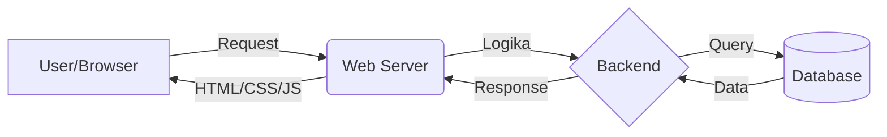

# 01 - Fundamental Web Development

Sebelum kita mulai menulis kode, penting untuk memahami bagaimana sebuah website bekerja di balik layar. Sebuah website modern umumnya terdiri dari 4 komponen utama.

## Bahan Dasar Website

1.  **Web Server**: Komputer (atau software) yang menyimpan file website dan mengirimkannya ke browser pengguna.
2.  **Frontend (Client-side)**: Segala sesuatu yang dilihat dan berinteraksi langsung dengan pengguna di browser.
3.  **Backend (Server-side)**: "Otak" dari website yang memproses logika, keamanan, dan komunikasi dengan database.
4.  **Database**: Tempat penyimpanan data secara permanen (seperti data pengguna, postingan, dll).

### Visualisasi Alur Kerja Website

---

## Perbedaan Frontend & Backend

Keduanya bekerja bersama untuk menciptakan pengalaman pengguna yang mulus.

### 1. Frontend
Fokus pada tampilan, tata letak, dan interaktivitas.
- **Bahasa Utama**: HTML (Struktur), CSS (Gaya), JS (Interaksi).
- **Framework Populer**:
  - **CSS**: [Tailwind CSS](https://tailwindcss.com), [Bootstrap](https://getbootstrap.com).
  - **JS**: [React.js](https://react.dev), [Vue.js](https://vuejs.org).
- **Situs Belajar**: [W3Schools Frontend](https://www.w3schools.com/where_to_start.asp)

### 2. Backend
Fokus pada keamanan, integritas data, dan integrasi API.
- **Bahasa & Framework**:
  - **PHP**: [Laravel](https://laravel.com).
  - **Node.js**: [Express](https://expressjs.com).
  - **Python**: [Django](https://djangoproject.com), [Flask](https://flask.palletsprojects.com).
  - **Go**: [Echo](https://echo.labstack.com), [Gin](https://gin-gonic.com).
- **Situs Belajar**: [W3Schools PHP](https://www.w3schools.com/php/)

---

## Database
Database adalah gudang data. Ada dua tipe utama yang sering digunakan:
1.  **SQL (Relasional)**: Data terstruktur dalam tabel (contoh: MySQL, PostgreSQL).
2.  **NoSQL (Non-Relasional)**: Data lebih fleksibel, biasanya dalam format dokumen (contoh: MongoDB).

> [!NOTE]
> Dalam Vibecoding, Anda bisa meminta AI untuk membuatkan **diagram arsitektur** sederhana seperti di atas untuk membantu memvisualisasikan ide software Anda sebelum mulai koding.
