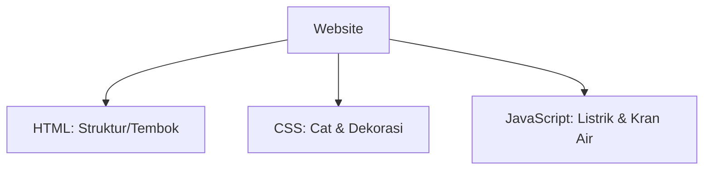

# 02 - Dasar HTML, CSS, & JS

Untuk membangun website, kita perlu memahami tiga bahasa utama yang berjalan di browser.

## 1. HTML (HyperText Markup Language)
HTML digunakan untuk menentukan **struktur** atau kerangka website.

### Syntax yang Sering Dipakai:
```html
<!DOCTYPE html>
<html>
<head>
    <title>Judul Halaman</title>
</head>
<body>
    <h1>Ini Heading Utama</h1>
    <p>Ini adalah sebuah paragraf.</p>
    <a href="https://www.w3schools.com">Ini Link ke W3Schools</a>
    
    <ul>
        <li>Item Daftar 1</li>
        <li>Item Daftar 2</li>
    </ul>
</body>
</html>
```
- [Belajar HTML Lengkap di W3Schools](https://www.w3schools.com/html/)

---

## 2. CSS (Cascading Style Sheets)
CSS digunakan untuk menentukan **tampilan** (warna, font, tata letak).

### Syntax yang Sering Dipakai:
```css
/* Mengatur gaya untuk body */
body {
    background-color: #f4f4f4;
    font-family: Arial, sans-serif;
}

/* Mengatur gaya untuk heading h1 */
h1 {
    color: darkblue;
    text-align: center;
}

/* Class selector */
.kotak-biru {
    background-color: blue;
    color: white;
    padding: 20px;
    border-radius: 8px;
}
```
- [Belajar CSS Lengkap di W3Schools](https://www.w3schools.com/css/)

---

## 3. JavaScript (JS)
JS digunakan untuk memberikan **interaktivitas** (animasi, pengolahan data di sisi client).

### Syntax yang Sering Dipakai:
```javascript
// Menampilkan pesan di console
console.log("Halo dari JavaScript!");

// Variabel
let nama = "Budi";

// Fungsi
function sapaPengguna() {
    alert("Halo " + nama + "!");
}

// Manipulasi DOM (Document Object Model)
document.getElementById("tombol").onclick = function() {
    document.getElementById("teks").innerHTML = "Teks telah diubah!";
};
```
- [Belajar JS Lengkap di W3Schools](https://www.w3schools.com/js/)

---

## Visualisasi: Anatomi Website (Analogi Rumah)



> [!TIP]
> Saat Vibecoding, Anda bisa memberikan prompt seperti: *"Buatkan saya struktur HTML untuk landing page yang punya navbar, hero section, dan footer menggunakan Tailwind CSS."*
