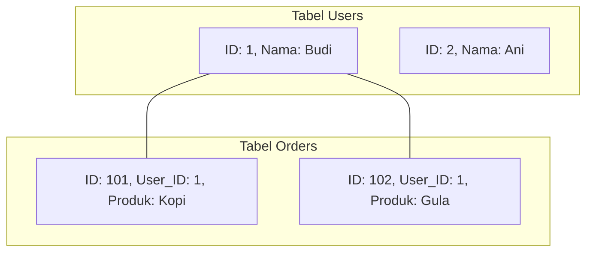
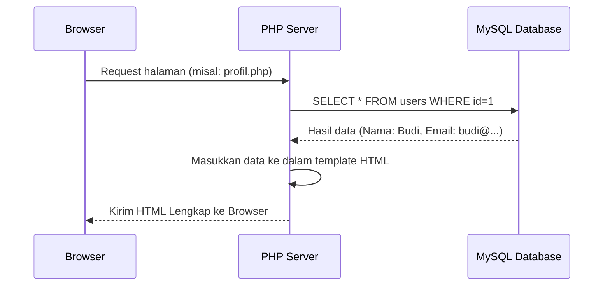

# 03 - Dasar PHP & MySQL

PHP dan MySQL adalah kombinasi klasik dalam pengembangan web untuk membangun aplikasi yang dinamis.

## 1. Belajar Dasar PHP
PHP adalah bahasa pemrograman *server-side* yang digunakan untuk mengolah data sebelum dikirim ke browser.

### Syntax yang Sering Dipakai:
```php
<?php
// Menampilkan teks
echo "Halo dunia!";

// Variabel
$nama = "Junaidi";
$umur = 25;

// Percabangan (If Else)
if ($umur >= 18) {
    echo "Sudah Dewasa";
} else {
    echo "Masih Anak-anak";
}

// Perulangan (Loops)
for ($i = 1; $i <= 5; $i++) {
    echo "Angka ke-".$i."<br>";
}

// Array
$buah = array("Apel", "Jeruk", "Mangga");
echo $buah[0];
?>
```
- [Belajar PHP Lengkap di W3Schools](https://www.w3schools.com/php/)

---

## 2. Belajar Query MySQL
Query adalah instruksi yang kita berikan kepada database. Berikut adalah query yang paling sering digunakan (CRUD):

### Syntax yang Sering Dipakai:

1. **SELECT** (Mengambil data):
    ```sql
    SELECT * FROM users; -- Mengambil semua kolom dari tabel users
    SELECT name, email FROM users WHERE id = 1; -- Mengambil nama dan email user ID 1
    ```

2. **INSERT** (Menambah data):
    ```sql
    INSERT INTO users (name, email) VALUES ('Budi', 'budi@example.com');
    ```

3. **UPDATE** (Mengubah data):
    ```sql
    UPDATE users SET email = 'budi_baru@example.com' WHERE id = 1;
    ```

4. **DELETE** (Menghapus data):
    ```sql
    DELETE FROM users WHERE id = 1;
    ```

5. **JOIN** (Menggabungkan dua tabel):
    ```sql
    -- Mengambil data postingan beserta nama penulisnya
    SELECT posts.title, users.name 
    FROM posts 
    INNER JOIN users ON posts.user_id = users.id;
    ```

- [Belajar MySQL Lengkap di W3Schools](https://www.w3schools.com/sql/)

---

## Memahami JOIN (Penggabungan Tabel)
Dalam database relasional, seringkali data dipisah ke beberapa tabel. JOIN digunakan untuk menyatukan data tersebut kembali saat dibutuhkan.

### Contoh Visual JOIN:
Bayangkan kita punya tabel `users` (pengguna) dan tabel `orders` (pesanan).



**Query JOIN:**  
`SELECT users.name, orders.product FROM users INNER JOIN orders ON users.id = orders.user_id;`

**Hasilnya:**
- Budi | Kopi
- Budi | Gula

---

## Visualisasi: Cara Kerja PHP & Database



> [!IMPORTANT]
> Jangan pernah lupa menyertakan klausa `WHERE` pada query `UPDATE` dan `DELETE`, jika tidak, Anda akan mengubah atau menghapus **SELURUH** filter data di tabel tersebut!
