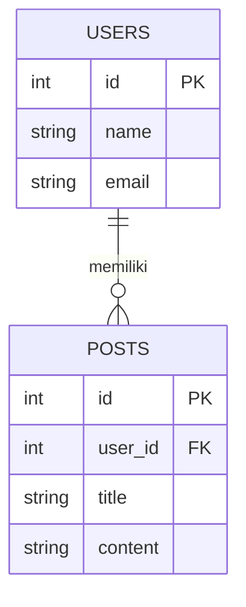

# 04 - Belajar Database Modern

Memahami bagaimana menyimpan data dengan benar adalah kunci utama aplikasi yang handal.

## Perbedaan SQL dan NoSQL

| Fitur | SQL (Relasional) | NoSQL (Non-Relasional) |
| :--- | :--- | :--- |
| **Model Data** | Tabel (Baris & Kolom) | Dokumen (JSON/BSON), Key-Value |
| **Skema** | Tetap (Sudah ditentukan) | Dinamis (Bisa berubah-ubah) |
| **Scaling** | Vertikal (Tambah Spek Server) | Horisontal (Tambah Jumlah Server) |
| **Contoh** | MySQL, PostgreSQL, SQL Server | MongoDB, Firebase, Redis |

### Contoh Studi Kasus NoSQL yang Lebih Detail:
1.  **Sistem Notifikasi Real-time**: Karena NoSQL (seperti MongoDB atau Redis) sangat cepat dalam menulis data, cocok untuk menyimpan ribuan notifikasi yang masuk setiap detik.
2.  **Feed Sosial Media**: Bayangkan Facebook atau Instagram. Data postingan setiap orang bisa berbeda-beda formatnya (ada yang pakai video, ada yang cuma teks, ada yang polling). NoSQL sangat fleksibel menangani ini.
3.  **Keranjang Belanja (E-commerce)**: Data keranjang belanja yang sifatnya sementara dan sering berubah lebih efisien disimpan di NoSQL.
4.  **Big Data & Logging**: Menyimpan catatan aktivitas user (log) yang jumlahnya jutaan baris per hari.

### Kapan Pilih SQL?
- Gunakan SQL jika data Anda sangat terstruktur dan hubungan antar data sangat penting (misal: Sistem Akuntansi atau Database Bank).

## Bagaimana Contoh Database Relasi?

Relasi database adalah hubungan antara satu tabel dengan tabel lainnya.

### Tipe Relasi Utama:
1.  **One-to-One**: 1 User memiliki 1 Profil.
2.  **One-to-Many**: 1 User memiliki banyak Postingan.
3.  **Many-to-Many**: Banyak Siswa mengambil banyak Mata Pelajaran.

### Visualisasi Relasi (ERD Sederhana):

---

## Tips Merancang Database
- **Gunakan Nama yang Jelas**: Gunakan nama tabel jamak (e.g., `users`, `products`).
- **Pahami Primary Key (PK)**: Identitas unik untuk setiap baris data.
- **Pahami Foreign Key (FK)**: Referensi ke PK di tabel lain untuk menciptakan relasi.

> [!TIP]
> Saat merancang database di Vibecoding, Anda bisa meminta AI: *"Buatkan rancangan database (ERD) untuk aplikasi perpustakaan sederhana dengan relasi antara buku, peminjam, dan transaksi peminjaman."*
