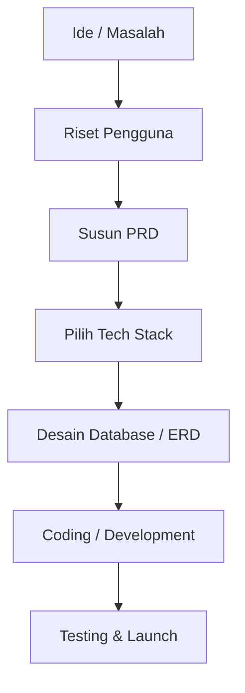

# 05 - Dasar Menyusun PRD (Product Requirement Document)

Sebelum menulis baris kode pertama, Anda harus tahu **APA** yang sedang Anda bangun dan **MENGAPA**. Itulah gunanya PRD.

## Langkah-langkah Menyusun PRD

### 1. Menentukan Tujuan & Masalah
Jelaskan masalah apa yang ingin Anda selesaikan dengan aplikasi ini.

### 2. Menyusun Modul Fitur
Bagi aplikasi menjadi bagian-bagian kecil (modul). Contoh modul untuk aplikasi e-commerce:
- Modul Otentikasi (Login/Register)
- Modul Katalog Produk
- Modul Keranjang & Pembayaran
- Modul Manajemen Profil

---

### 3. Menyusun Fitur dari Berbagai POV (Point of View)
Analisis fitur berdasarkan siapa yang akan menggunakannya.

| Fitur | POV: Admin | POV: Manager | POV: Customer |
| :--- | :--- | :--- | :--- |
| **Pesanan** | Mengubah status pesanan, memantau pengiriman. | Melihat laporan penjualan bulanan, omzet. | Melacak posisi barang, memberikan ulasan. |
| **Produk** | Menambah, mengedit, atau menghapus produk. | Analisis produk paling laris (best seller). | Mencari, memfilter, dan melihat detail produk. |

---

### 4. Menyusun Tech Stack
Tentukan teknologi yang digunakan. Contoh:
- **Frontend**: Blade Template (Laravel) + Tailwind CSS.
- **Backend**: Laravel 12 (PHP 8.2+).
- **Database**: MySQL.
- **Tools**: GitHub (Versi Kontrol), Postman (Uji API).

## Visualisasi: Alur Kerja Perencanaan ke Development

---

## Contoh Format Sederhana PRD (versi Vibecoding)
Saat ingin membuat proyek, berikan asisten AI PRD singkat seperti ini:
- **Nama Proyek**: Aplikasi Kasir Warung (VapeStore).
- **Target Pengguna**: Admin Toko dan Pemilik.
- **Fitur Utama**: Scan barcode, cetak struk, laporan harian.
- **Stack**: Laravel + MySQL.

> [!TIP]
> Di Vibecoding, Anda bisa meminta AI: *"Saya mau buat aplikasi toko online. Tolong buatkan daftar fitur yang diperlukan dari POV Admin dan Customer secara mendetail."*
