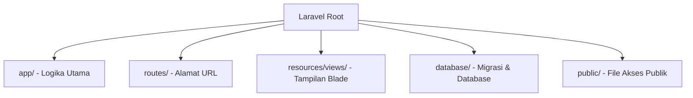

# 06 - Instalasi XAMPP & Laravel 12

Sekarang waktunya menyiapkan komputer Anda untuk pengembangan web secara lokal.

## 1. Belajar Install XAMPP
XAMPP adalah paket software yang berisi Apache (Web Server), PHP, dan MariaDB/MySQL (Database).

### Langkah-langkah:
1.  Unduh XAMPP di [apachefriends.org](https://www.apachefriends.org/download.html).
2.  Pilih versi PHP terbaru (minimal PHP 8.2 untuk Laravel 12).
3.  Jalankan installer dan ikuti petunjuknya.
4.  Buka **XAMPP Control Panel** dan klik **Start** pada modul Apache dan MySQL.

---

## 2. Belajar Install Laravel 12
Laravel adalah framework PHP paling populer saat ini. Versi 12 baru saja dirilis!

### Persiapan:
Sebelum menginstall Laravel, Anda butuh **Composer** (pengelola paket PHP). Unduh di [getcomposer.org](https://getcomposer.org/download/).

### Cara Install Laravel (Proyek Baru):
1.  Buka Terminal (atau CMD/PowerShell).
2.  Jalankan perintah berikut untuk menginstall Laravel secara global:
    ```bash
    composer global require laravel/installer
    ```
3.  Masuk ke direktori `htdocs` (biasanya di `C:\xampp\htdocs` atau `/Applications/XAMPP/htdocs`).
4.  Buat proyek baru:
    ```bash
    laravel new nama-proyek-saya
    ```
5.  Masuk ke folder proyek:
    ```bash
    cd nama-proyek-saya
    ```
6.  **Jalankan Server Laravel**:
    Untuk melihat website Anda di browser, jalankan perintah:
    ```bash
    php artisan serve
    ```
7.  Buka browser dan akses alamat: `http:localhost:8000`. Selamat! Website Laravel Anda sudah menyala.

---

## Visualisasi: Struktur Folder Laravel 12



- [Dokumentasi Resmi Laravel 12](https://laravel.com/docs/12.x)

> [!CAUTION]
> Pastikan versi PHP Anda sesuai. Cek dengan mengetik `php -v` di terminal. Jika di bawah 8.2, Laravel 12 tidak akan bisa berjalan.
