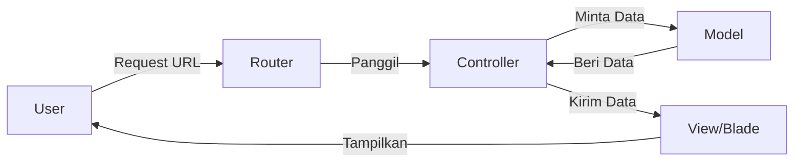

# 07 - Belajar Login & CRUD Laravel 12

Setelah berhasil menginstall Laravel, mari kita pelajari bagaimana membangun fitur inti: Login dan CRUD (Create, Read, Update, Delete).

## 1. Konsep MVC (Model-View-Controller)
Laravel menggunakan pola MVC untuk memisahkan tugas.



---

## 2. Membuat Fitur Login
Laravel menyediakan cara instan untuk membuat fitur login yang sangat aman menggunakan **Laravel Breeze**.

### Cara Install Breeze:
1. Di folder proyek Anda, ketik:
   ```bash
   php artisan breeze:install
   ```
2. Pilih stack (misal: Blade).
3. Jalankan migrasi database:
   ```bash
   php artisan migrate
   ```
Sekarang website Anda sudah punya fitur Login, Register, dan Reset Password!

---

## 3. Membuat Fitur CRUD
Mari kita ambil contoh sederhana CRUD untuk tabel **Produk**.

### Langkah 1: Persiapan Database
Pastikan Anda sudah membuat database kosong di XAMPP (phpMyAdmin) dengan nama `belajar_laravel`. Kemudian buka file `.env` di folder proyek dan sesuaikan:
```env
DB_CONNECTION=mysql
DB_HOST=127.0.0.1
DB_PORT=3306
DB_DATABASE=belajar_laravel
DB_USERNAME=root
DB_PASSWORD=
```

### Langkah 2: Buat Model, Migration, & Controller
Gunakan perintah ini untuk membuat 3 file sekaligus:
```bash
php artisan make:model Product -mc
```
- **Model** (`app/Models/Product.php`): Jembatan ke database.
- **Migration** (`database/migrations/...`): Blueprint struktur tabel.
- **Controller** (`app/Http/Controllers/ProductController.php`): Tempat menulis logika.

### Langkah 3: Membuat Struktur Tabel (Migration)
Buka file migration yang baru dibuat di folder `database/migrations/`. Tambahkan kolom `name` dan `price`:
```php
public function up(): void
{
    Schema::create('products', function (Blueprint $table) {
        $table->id();
        $table->string('name'); // Nama Produk
        $table->integer('price'); // Harga Produk
        $table->timestamps();
    });
}
```
Setelah itu, jalankan perintah: `php artisan migrate`. Tabel `products` sekarang sudah ada di MySQL!

### Langkah 4: Menulis Logika di Controller
Buka `app/Http/Controllers/ProductController.php`. Tambahkan fungsi untuk menampilkan data:
```php
namespace App\Http\Controllers;
use App\Models\Product;
use Illuminate\Http\Request;

class ProductController extends Controller
{
    public function index() {
        $data_produk = Product::all(); // Mengambil semua data dari tabel products
        return view('halaman_produk', ['products' => $data_produk]);
    }
}
```

### Langkah 5: Membuat Tampilan (View)
Buat file baru di `resources/views/halaman_produk.blade.php`:
```html
<h1>Daftar Produk Kami</h1>
<ul>
    @foreach($products as $p)
        <li>{{ $p->name }} - Harga: Rp{{ $p->price }}</li>
    @endforeach
</ul>
```

### Langkah 6: Mengatur Alamat (Route)
Buka `routes/web.php` dan tambahkan:
```php
use App\Http\Controllers\ProductController;

Route::get('/daftar-produk', [ProductController::class, 'index']);
```
Sekarang akses `http://127.0.0.1:8000/daftar-produk` di browser Anda!

---

## Tips Belajar Lengkap
- [Kursus Laravel di Laracasts](https://laracasts.com/)
- [W3Schools Laravel Tutorial](https://www.w3schools.com/php/php_frameworks.asp)

> [!IMPORTANT]
> Di Vibecoding, Anda bisa menyuruh AI: *"Buatkan controller, migration, dan view untuk fitur CRUD Karyawan (Nama, Jabatan, Gaji) menggunakan Tailwind CSS."*
