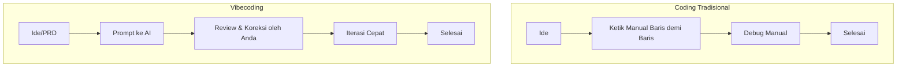

# 08 - Mengenal Vibecoding & Prompt Engineering

Setelah memahami dasar koding manual di Pertemuan 1, sekarang kita masuk ke era baru: **Vibecoding**.

## Apa itu Vibecoding?
Vibecoding adalah metode membangun software di mana programmer lebih banyak bertindak sebagai **"Conductor"** atau **"Architect"** daripada sekadar pengetik kode. Anda memberikan ide, arahan, dan "vibe" aplikasi Anda, sementara AI membantu melakukan implementasi teknisnya.

### Kenapa Harus Belajar Dasar Coding Dulu?
AI bisa membuat kesalahan. Tanpa pemahaman dasar (HTML, PHP, DB), Anda tidak akan tahu jika kode yang dihasilkan AI itu benar, aman, atau efisien. Dasar koding adalah "radar" Anda.

---

## Dasar Prompt Engineering
Prompt Engineering adalah seni memberikan instruksi kepada AI agar mendapatkan hasil yang sesuai keinginan.

### Teknik Prompting "Context-First":
Jangan langsung minta kode. Berikan konteks terlebih dahulu.

**Buruk (Low Context):**
> "Buatkan fitur login Laravel."

**Bagus (High Context - R-A-C-E Formula):**
- **Role**: "Bertindaklah sebagai Senior Laravel Developer."
- **Action**: "Buatkan fitur login."
- **Context**: "Menggunakan Laravel 12 dan Laravel Breeze, database MySQL."
- **Expectation**: "Gunakan Tailwind CSS untuk styling agar terlihat modern dan clean."

---

## Visualisasi: Perbedaan Alur Kerja

### Tips Prompting untuk Pemula:
1. **Be Specific**: Sebutkan nama tabel, nama kolom, dan teknologi yang dipakai.
2. **Step-by-Step**: Jangan minta aplikasi utuh sekaligus. Minta modul per modul (misal: "Buat database dulu", lalu "Buat login", dst).
3. **Ask for Explanation**: Jika Anda tidak paham kodenya, tanya AI: *"Tolong jelaskan cara kerja fungsi ini baris demi baris."*

> [!TIP]
> Vibecoding bukan berarti Anda malas, tapi Anda bekerja **lebih cerdas**. Fokuslah pada *logika bisnis* dan *user experience*, biarkan AI mengurus *syntax*.
