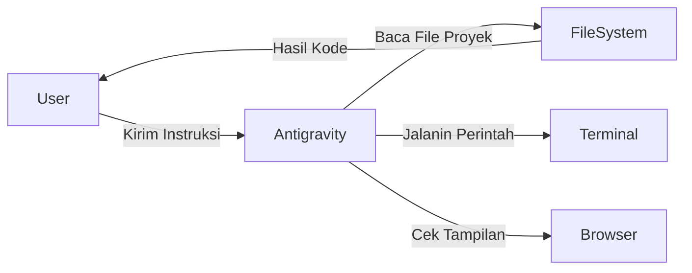

# 09 - Panduan Menggunakan Antigravity

**Antigravity** adalah asisten koding AI yang dirancang untuk bekerja langsung di dalam proyek Anda. Ia bukan sekadar chat bot, tapi agen yang bisa membaca file, membuat file, dan menjalankan perintah di komputer Anda.

## Fitur Utama Antigravity

1. **Codebase Awareness**: Antigravity bisa melihat seluruh isi folder proyek Anda, sehingga ia paham konteks kodingan yang sudah ada.
2. **Multi-File Editing**: Ia bisa mengubah banyak file sekaligus (misal: mengupdate Controller dan View secara bersamaan).
3. **Terminal Access**: Ia bisa membantu menjalankan perintah seperti `php artisan migrate` atau `npm run dev`.
4. **Browser Testing**: Ia bisa membuka browser untuk memverifikasi apakah website yang dibuat sudah benar tampilannya.

---

## Cara Berinteraksi dengan Antigravity

### 1. Mode Chat (Tanya Jawab)
Gunakan ini untuk bertanya konsep atau meminta penjelasan kode.
- *"Kenapa query saya lambat?"*
- *"Bagaimana cara membuat relasi One-to-Many di Laravel?"*

### 2. Mode Task (Pengerjaan Tugas)
Gunakan ini untuk menyuruh Antigravity mengerjakan fitur.
- *"Tolong buatkan fitur manajemen santri mulai dari database sampai tampilannya."*
- *"Tolong rapikan tampilan tabel di halaman index.blade.php pakai Tailwind."*

---

## Visualisasi: Cara Kerja Antigravity

## Etika & Tips Kerja dengan Antigravity
- **Review Pekerjaannya**: Selalu periksa kode yang dibuat. Lihat apakah ada yang aneh.
- **Berikan Feedback**: Jika kodenya salah, jangan marah. Beritahu bagian mana yang salah: *"Tombol hapusnya belum berfungsi, tolong diperbaiki."*
- **Gunakan Artifacts**: Baca file `task.md` atau `walkthrough.md` yang dibuat Antigravity untuk melihat progres kerjanya.

> [!IMPORTANT]
> Antigravity adalah **Co-pilot**, Anda adalah **Pilot**-nya. Kendali tetap di tangan Anda!
