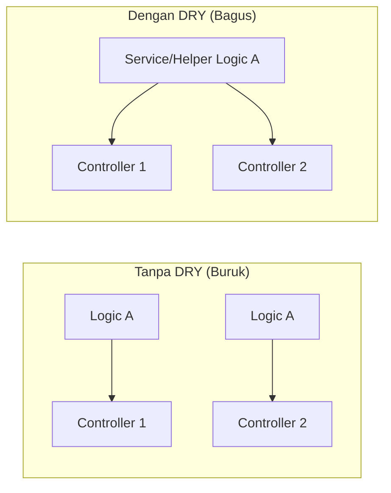
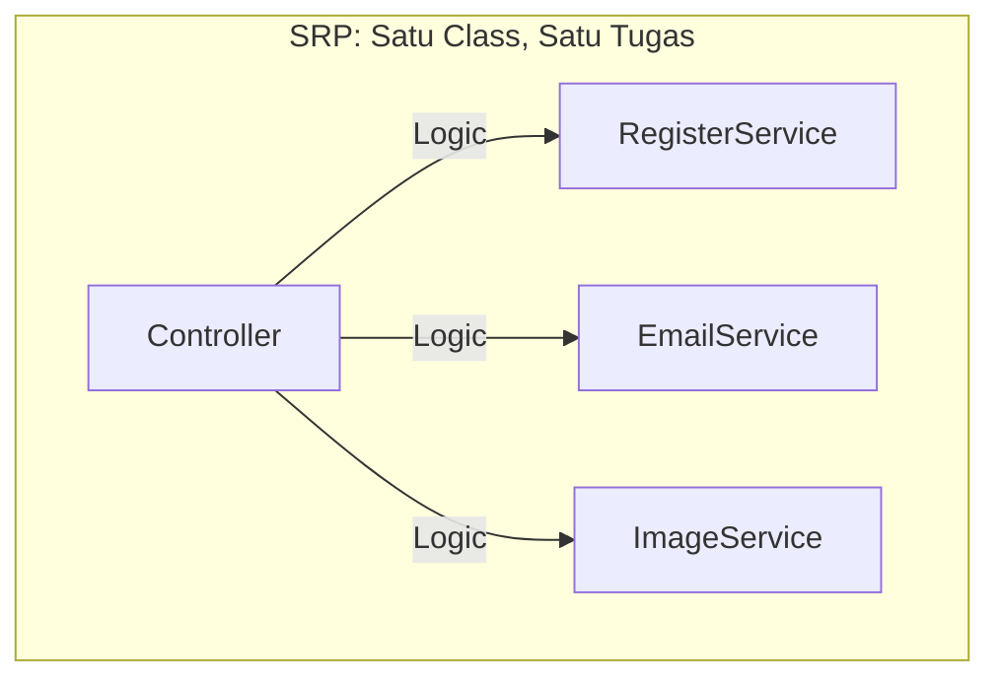
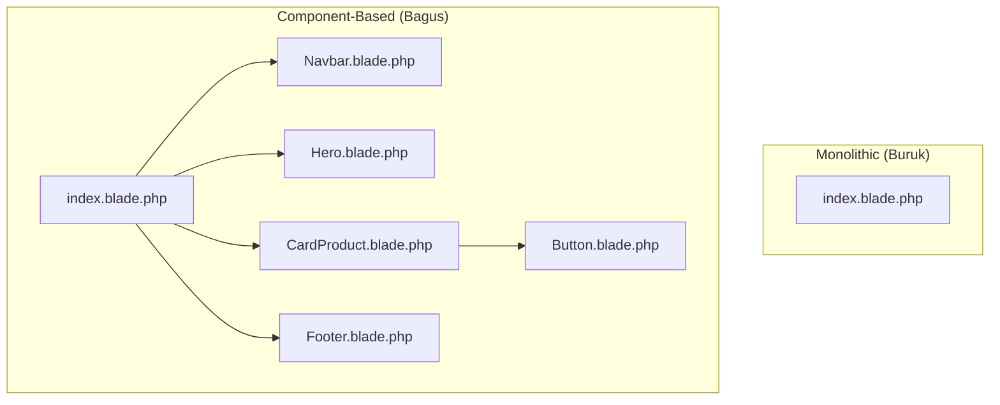
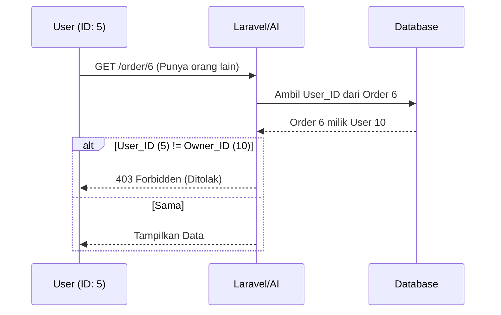
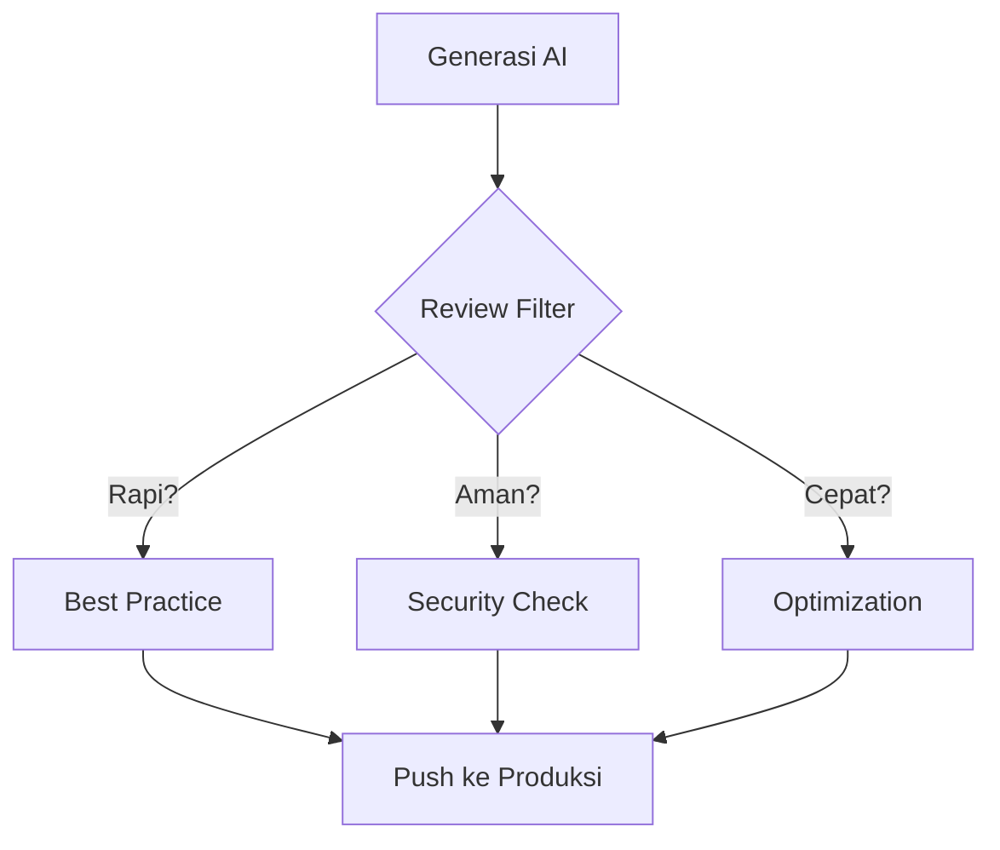

# 10 - Hal-hal Penting untuk Vibecoders

Vibecoding memang sangat cepat, tapi kecepatan tanpa kontrol bisa berbahaya. Sebagai Vibecoder, Anda harus tetap memegang kendali atas kualitas kode. Berikut adalah panduan etika koding dengan AI.

## 1. Best Practice (Mencegah "Spaghetti Code")
AI sering kali memberikan solusi yang langsung jalan, tapi belum tentu rapi dalam jangka panjang. Sebagai arsitek, Anda harus menerapkan dua prinsip utama ini:

### A. Prinsip DRY (Don't Repeat Yourself)

### B. Prinsip SOLID (Dasar Arsitektur Clean Code)

- **Open/Closed**: Tambah fitur baru tanpa ngerusak kode lama.
- **Dependency Inversion**: Class tinggi gak boleh tergantung class rendah (pakai Interface).

### C. Pemisahan Komponen UI (Decomposition)
Jangan buat satu file HTML/Blade yang isinya ribuan baris. Pecah bagian-bagian kecil menjadi komponen agar mudah dikelola dan digunakan kembali.

> [!TIP]
> **Tugas Anda sebagai Vibecoder**: Saat melihat file tampilan sudah terlalu panjang, katakan ke AI: *"Tolong pecah section di file ini menjadi komponen Blade yang terpisah agar lebih modular."*

---

## 2. Security (Keamanan adalah Utama)

### Visualisasi: Authorization Check (Cek Kepemilikan)

> [!CAUTION]
> **Jangan Asal Percaya**: AI mungkin lupa nambahin proteksi ini. Selalu double check kode controller Anda!

---

## 3. Optimization (Kinerja & Skalabilitas)
Aplikasi yang jalan tapi lemot akan ditinggalkan pengguna.

- **Database Query**: Cek apakah AI membuat query yang boros (seperti masalah **N+1 Query**). Minta AI menggunakan `eager loading` (contoh: `with('user')`).
- **Index Database**: Pastikan kolom yang sering dicari sudah diberi **Index** di migration.
- **Server-side vs Client-side**:
  - Gunakan **Server-side Rendering (Blade)** untuk halaman yang butuh SEO dan loading awal cepat.
  - Gunakan **Client-side Interactivity** untuk fitur dashboard yang butuh interaksi dinamis tanpa refresh.
- **Bom Waktu User**: Cek proses berat seperti looping besar. Sesuatu yang terasa cepat untuk 10 user bisa menjadi sangat lambat saat user mencapai 10.000.

---

## Visualisasi: Mentalitas Vibecoder

> [!IMPORTANT]
> Pekerjaan Anda bukan lagi "menulis kode", tapi **"memastikan kode benar"**. Gunakan waktu yang Anda hemat dari mengetik manual untuk melakukan review keamanan dan optimasi.
