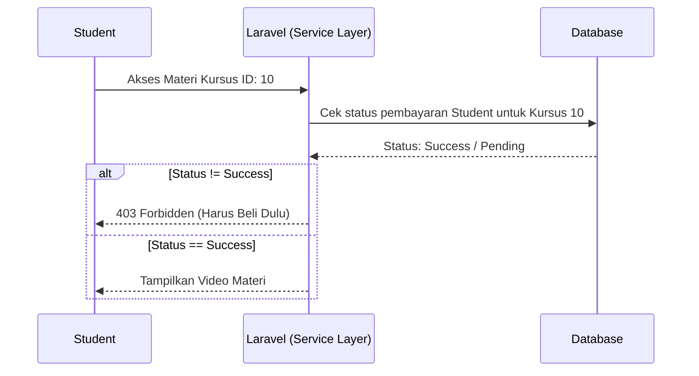

# 11 - Studi Kasus: Membangun Platform LMS (Vibe-Learn)

Materi penutup ini adalah tantangan nyata. Kita akan membangun **Vibe-Learn**, sebuah platform kursus online dengan 3 role berbeda dan fitur pembayaran, dengan menerapkan **Best Practices** yang sudah kita pelajari.

---

## Langkah 1: Menyusun Vibe & Struktur (The PRD)
Ingat prinsip **Architect First**.

**Contoh Prompt Utama (High Context):**
> "Bertindaklah sebagai Senior Fullstack Developer & System Architect. Saya ingin membuat proyek 'Vibe-Learn' (LMS) menggunakan Laravel 12. 
> - **Requirement**: 3 role (Admin, Instructor, Student).
> - **Goal**: Student bisa beli kursus dan belajar lewat video/materi.
> - **Architecture**: Saya ingin kode yang **SOLID**, pisahkan logic bisnis ke dalam **Service Classes**, jangan tumpuk semua di Controller.
> - **Vibe UI**: Dark Mode, Glassmorphism, Tailwind CSS, smooth animations.
> Tolong buatkan dulu Entity Relationship Diagram (ERD) dan rencana modul pengerjaannya."

---

## Langkah 2: Merancang Database (Data Integrity)
Terapkan prinsip **Security** sejak awal di level database.

**Contoh Prompt Database:**
> "Buatkan migration untuk tabel `courses`, `lessons`, dan `orders`. 
> - Pastikan setiap tabel punya relasi yang benar (Foreign Keys).
> - Tambahkan **Indexing** pada kolom yang sering dicari (seperti `user_id` dan `status`).
> - Buatkan Model-nya dan pastikan **Mass Assignment Protection** (menggunakan `$fillable`) sudah diset agar aman."

---

## Langkah 3: Membuat UI Dashboard 3 Role (Decomposition)
Terapkan prinsip **Pemisahan Komponen**.

**Contoh Prompt UI:**
> "Buatkan dashboard utama untuk 3 role tersebut. 
> - **Penting**: Jangan buat satu file raksasa. **Pecah menjadi komponen Blade** yang kecil (Navbar, Sidebar, StatCards, CourseList).
> - Gunakan **Blade Components** agar reusable. 
> - Tambahkan state loading dan animasi transisi yang halus menggunakan Tailwind dan Alpine.js."

---

## Langkah 4: Logika Pembayaran & Enrolment (Security & DRY)
Terapkan prinsip **Authorization** dan **DRY**.

**Contoh Prompt Logika:**
> "Buatkan logika Checkout kursus. 
> - Gunakan **Service Class** (`CheckoutService`) untuk menangani proses pembuatan order (Prinsip SRP/DRY). 
> - **Keamanan (Authorization)**: Tambahkan Middleware atau Policy untuk memastikan Student tidak bisa mengakses file lesson jika status `orders` belum `success`. 
> - Gunakan **Eager Loading** (`with('course')`) saat mengambil data order untuk optimasi database (mencegah N+1 query)."

---

## Visualisasi: Flow Pembayaran & Security Check

---

## Tips Menjadi Pro Vibecoder
1. **Iterasi Terus**: Jika tampilan kurang keren, jangan menyerah. Katakan: *"Tolong tambahkan gradasi warna yang lebih deep dan border-glow pada card-nya."*
2. **Handle Error**: Jika ada error, copy-paste pesan errornya ke AI: *"Saya dapat error 'Target class [ProductController] does not exist', tolong perbaiki routingnya."*
3. **Refaktor**: Mintalah AI merapikan kode Anda: *"Tolong rapikan Controller ini agar lebih clean mengikuti prinsip SOLID."*

---
### 🎉 Misi Selesai!
Selamat! Anda kini bukan sekadar "pengetik kode", tapi seorang **Software Architect** yang diberdayakan oleh AI. Teruslah bereksperimen dan bangun aplikasi impian Anda!
