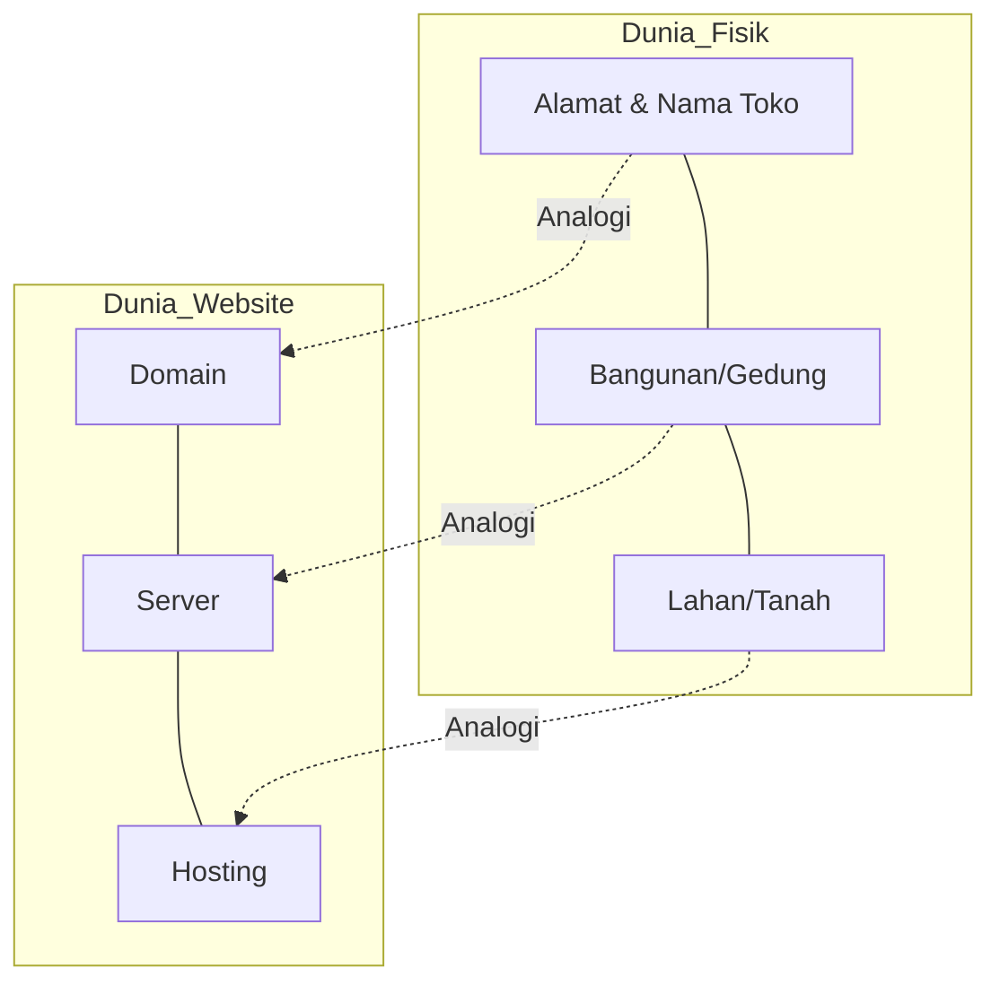

# Konsep Hosting, Server, dan Domain

Materi ini menjelaskan dasar-dasar infrastruktur internet yang membuat sebuah website bisa diakses oleh siapa saja di seluruh dunia.

## 1. Apa itu Server?
**Server** adalah sebuah komputer khusus yang "selalu menyala" dan terhubung ke internet 24/7. 
- Di dalamnya terdapat file-file website (HTML, CSS, JS, Gambar, Database).
- Tugasnya adalah melayani (*serve*) permintaan dari browser pengguna.

## 2. Apa itu Hosting?
**Hosting** adalah layanan penyewaan ruang atau kapasitas server untuk menyimpan file website.
- Jika Server adalah **komputernya**, maka Hosting adalah **jasanya**.

### Analogi Dunia Nyata:
Bayangkan Anda ingin membuka **Toko Fisik** (Website):

- **Server:** Adalah Bangunan/Gedung tokonya.
- **Hosting:** Adalah Biaya sewa lahan atau ruang di dalam gedung tersebut.
- **Domain:** Adalah Nama Toko / Alamat Tokonya.

## 3. Shared Hosting vs VPS
Dua jenis hosting yang paling umum digunakan adalah Shared Hosting dan VPS (Virtual Private Server).

| Perbandingan | Shared Hosting | VPS (Virtual Private Server) |
| :--- | :--- | :--- |
| **Konsep** | Satu server dipakai ramai-ramai | Satu server fisik dibagi secara virtual, Anda punya ruang privat sendiri |
| **Kontrol** | Sangat terbatas | Penuh (Bisa install apapun) |
| **Performa** | Tergantung beban user lain | Stabil dan terjamin |
| **Harga** | Murah (Terjangkau) | Lebih Mahal |

### Analogi Shared Hosting vs VPS:
- **Shared Hosting = Kontrakan / Kost-kostan.** 
  Satu rumah besar dihuni banyak orang. Anda berbagi air, listrik (Resource: CPU/RAM), dan jika ada satu penghuni yang bikin ribut (website kena DDoS atau trafik tinggi), penghuni lain bisa kena dampaknya (website jadi lambat).
- **VPS = Apartemen dengan Fasilitas Pribadi.**
  Meskipun dalam satu gedung, Anda punya unit sendiri dengan meteran listrik dan air sendiri. Apa pun yang dilakukan tetangga di unit sebelah, tidak akan mempengaruhi performa unit Anda.

## 4. cPanel: Remote Control untuk Shared Hosting
Di dunia Shared Hosting, Anda biasanya akan mendapatkan akses ke **cPanel**.
- **[cPanel](https://cpanel.net)** adalah Dashboard (tampilan web) yang memudahkan Anda mengelola hosting tanpa perlu mengetik kode perintah (coding).
- Melalui **cPanel**, Anda bisa membuat email bisnis (contoh: `admin@tokoanda.com`), mengupload file, membuat database, hingga menginstal WordPress hanya dengan satu klik.

## 5. Apa itu Domain?
**Domain** adalah nama unik yang digunakan untuk mengidentifikasi alamat IP server agar lebih mudah diingat manusia.
- Contoh: `google.com`, `vibecoding.id`.
- Tanpa domain, kita harus mengetik angka rumit (IP Address) seperti `142.251.10.102` untuk membuka website.

### Analogi:
- **IP Address:** Titik Koordinat GPS (Contoh: -6.2088, 106.8456).
- **Domain:** Nama Tempatnya (Contoh: "Monas").
Tentu lebih mudah mengingat "Monas" daripada angka koordinatnya, bukan?
