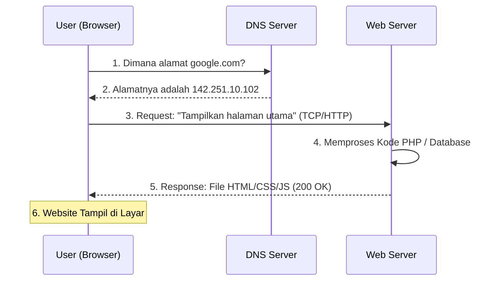

# Bagaimana Website Bisa Diakses di Internet?

Memahami perjalanan sebuah request dari saat kita mengetik URL hingga website muncul di layar.

## 1. Flow Perjalanan Data
Kira-kira begini detail apa yang terjadi di balik layar saat Anda menekan Enter:

## 2. Peran DNS (Domain Name System)
**DNS** sering disebut sebagai **Buku Telepon Internet**.
- Komputer berkomunikasi menggunakan angka (IP Address).
- Manusia lebih mudah mengingat nama (Domain).
- DNS mencari "Nomor HP" (IP Address) dari "Nama Kontak" (Domain) yang kita masukkan.

## 3. Request & Response Cycle
Setiap interaksi di internet adalah pertukaran antara Request dan Response.

1.  **Request:** Browser Anda meminta sesuatu ke server. 
    *   *Contoh:* "Halo server, saya mau lihat halaman `index.html`."
2.  **Server Processing:** Server menerima permintaan, mengecek database, menjalankan logika program.
3.  **Response:** Server mengirimkan data kembali ke browser. 
    *   *Contoh:* "Ini file HTML-nya, silakan ditampilkan."

### Status Code (Bahasa Isyarat Server)
Server sering memberikan kode status dalam responnya:
- **200 OK:** Permintaan berhasil.
- **404 Not Found:** Halaman tidak ditemukan.
- **500 Internal Server Error:** Server sedang error.
- **403 Forbidden:** Anda tidak punya akses ke halaman ini.

## 4. IP Address: Alamat Digital
Setiap perangkat yang terhubung ke internet memiliki **IP Address**.
- **Public IP:** Alamat server yang bisa dijangkau oleh siapapun di internet.
- **Private IP:** Alamat perangkat di dalam jaringan lokal (seperti LAN kantor atau WiFi rumah).
- **Static IP:** IP yang tidak pernah berubah (cocok untuk server).
- **Dynamic IP:** IP yang berubah-ubah setiap kali koneksi diulang.
