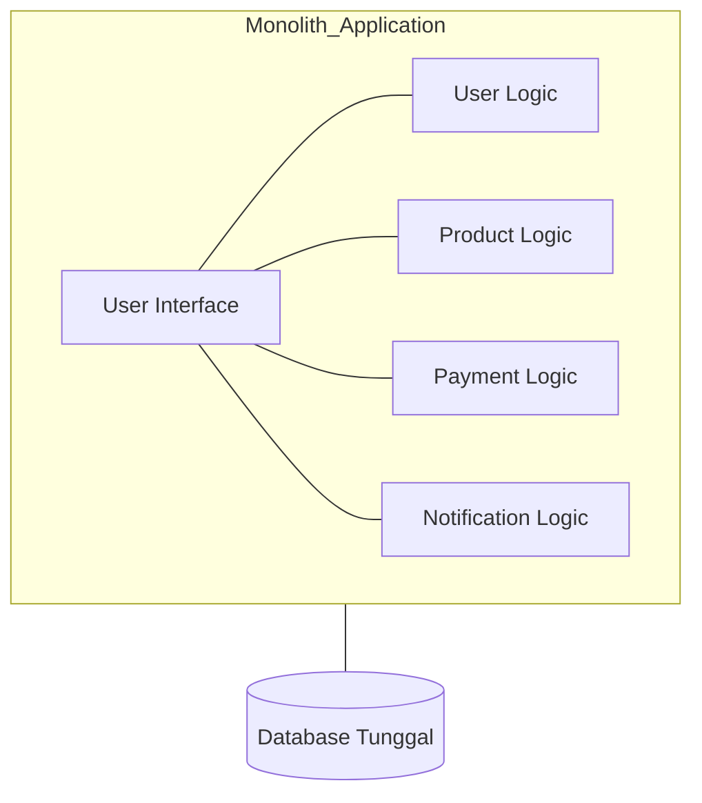
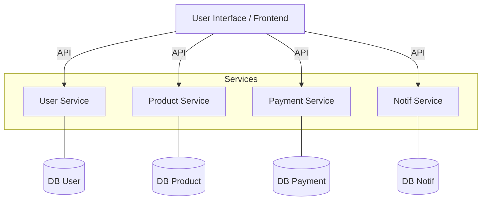

# Arsitektur Website: Monolith vs Microservices

Dalam dunia server, cara kita menyusun kode program dan infrastruktur sangat berpengaruh pada skalabilitas aplikasi.

## 1. Monolith Architecture
Semua fitur website (User Management, Product, Payment, Notification) digabung menjadi **satu proyek besar**.

### Kelebihan:
- **Mudah dikembangkan:** Di awal, development jauh lebih cepat.
- **Mudah di-deploy:** Cukup satu file/proyek yang dikirim ke satu server.
- **Performa Tinggi:** Tidak ada jeda komunikasi antar bagian karena semuanya satu memori.

### Kekurangan:
- **Susah Skala:** Jika fitur Payment lambat, kita harus menduplikasi seluruh proyek besar tersebut ke server baru.
- **Risiko Fatal:** Jika ada bug di ujung fitur kecil, seluruh website bisa mati total.
- **Maintenance Berat:** Kode menjadi sangat besar dan sulit dipahami setelah beberapa tahun.

**Analogi:** Seperti Rumah Tinggal. Semua ada di sana (Dapur, Kasur, TV). Kalau mau tambah satu kasur lagi, Anda mungkin harus merombak struktur rumah.

## 2. Microservices Architecture
Membagi aplikasi besar menjadi **layanan-layanan kecil** yang berdiri sendiri dan berkomunikasi lewat internet (API).

### Kelebihan:
- **Skalabel:** Jika fitur Payment banyak yang pakai, cukup tambah server khusus untuk layanan Payment saja.
- **Bebas Teknologi:** Fitur User bisa pakai Laravel, fitur Payment bisa pakai Go, fitur AI bisa pakai Python.
- **Mandiri:** Jika layanan Notifikasi mati, layanan Payment dan Login tetap bisa berjalan.

### Kekurangan:
- **Sangat Rumit:** Memerlukan tim infra yang jago karena mengelola banyak server/layanan sekaligus.
- **Latensi:** Ada jeda waktu saat layanan satu memanggil layanan lainnya lewat jaringan.
- **Debugging Susah:** Mencari penyebab error bisa memakan waktu karena data tersebar di banyak tempat.

**Analogi:** Seperti Food Court. Ada stan Pizza, stan Nasi Padang, dan stan Minuman. Semuanya punya manajemen sendiri. Kalau stan Pizza kebakaran, Anda masih bisa beli Nasi Padang.

## Kesimpulan: Mana yang Harus Dipilih?
- **Pilih Monolith jika:** Proyek baru dimulai, tim kecil, budget terbatas, atau ingin cepat rilis (MVP).
- **Pilih Microservices jika:** Proyek sudah sangat besar (seperti Gojek, Netflix), tim sudah ratusan orang, dan butuh stabilitas tingkat tinggi.
