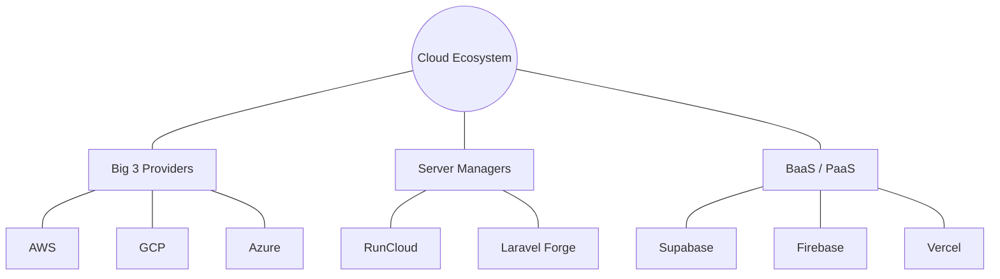

# Ekosistem Cloud Modern

Dunia hosting saat ini sudah jauh melampaui sekadar "Server Fisik". Mari mengenal istilah-istilah modern dalam ekosistem cloud.

## 1. Cloud Computing
Alih-alih menyewa satu server fisik, **Cloud Computing** memungkinkan kita menyewa sumber daya komputer (CPU, RAM, Storage) secara fleksibel dan bayar sesuai penggunaan (*Pay-as-you-go*).

**Pemain Utama (Big 3):**
1.  **[AWS (Amazon Web Services)](https://aws.amazon.com):** Terbesar, paling lengkap, tapi juga paling kompleks.
2.  **[Google Cloud Platform (GCP)](https://cloud.google.com):** Unggul di bidang Data, AI, dan kemudahan integrasi dengan ekosistem Google.
3.  **[Microsoft Azure](https://azure.microsoft.com):** Pilihan utama untuk perusahaan yang sudah menggunakan teknologi Microsoft.

## 2. Server Managers (Modern Hosting)
VPS seringkali sulit dikelola bagi pemula (harus pakai Terminal/CLI). **Server Managers** memudahkan kita mengelola VPS melalui tampilan web (Dashboard).

**Contoh Populer:**
- **[RunCloud](https://runcloud.io):** UI keren untuk mengelola server PHP/Laravel di VPS manapun (**[Vultr](https://www.vultr.com)**, **[DigitalOcean](https://www.digitalocean.com)**, **[Linode](https://www.linode.com)**).
- **[Laravel Forge](https://forge.laravel.com):** Tool resmi dari pembuat Laravel untuk setup server secepat kilat.
- **[Ploi](https://ploi.io):** Alternatif Forge dengan fitur yang sangat melimpah.

### cPanel vs Server Managers Modern
Apa bedanya cPanel yang biasa kita temui di Shared Hosting dengan Server Managers (RunCloud/Forge)?

| Fitur | cPanel (Tradisional) | Server Managers Modern |
| :--- | :--- | :--- |
| **Target Pengguna** | Pemula / Website Statis / WP | Developer / Startup / Apps |
| **Keamanan** | Shared Resource (Lebih Berisiko) | Isolated VPS (Lebih Aman) |
| **Fleksibilitas** | Terbatas pada fitur hosting | Penuh (Config server sendiri) |
| **Deployment** | Upload via FTP / File Manager | **Auto-deploy dari GitHub / Git** |
| **Skalabilitas** | Sulit (Stuck di shared server) | Sangat Mudah (Cukup ganti spek VPS) |

> [!NOTE]
> Sebagai **Vibecoder** yang menggunakan Laravel atau aplikasi modern, Anda sangat disarankan menggunakan **Server Managers** karena kemudahan integrasi dengan Git/GitHub dan performa yang jauh lebih kencang di atas VPS.

## 3. Backend as a Service (BaaS)
Layanan yang membuat Anda tidak perlu lagi membuat backend secara manual. Fitur seperti Database, Auth, dan File Storage sudah disediakan. Anda tinggal panggil lewat kode Frontend.

**Contoh Populer:**
- **[Supabase](https://supabase.com):** Sering disebut sebagai kompetitor Firebase yang open-source dan berbasis SQL (PostgreSQL).
- **[Firebase](https://firebase.google.com):** Produk Google yang sangat populer untuk aplikasi mobile dan web real-time.
- **[PocketBase](https://pocketbase.io):** Alternatif ringan yang berbasis SQLite.

## 4. Platform as a Service (PaaS)
Fokus hanya pada kode Anda. Tidak butuh setup server sama sekali (*No server management*). Anda tinggal hubungkan GitHub, dan website langsung online.

**Contoh Populer:**
- **[Vercel](https://vercel.com):** Standar emas untuk aplikasi Next.js dan React.
- **[Netlify](https://www.netlify.com):** Sangat populer untuk Static Site (Hugo, Jekyll, Eleventy).
- **[Railway](https://railway.app)** / **[Heroku](https://www.heroku.com)**: Paling mudah untuk deploy backend aplikasi (Node.js, Python, Laravel).

---

### Kesimpulan: Mana yang Harus Saya Pelajari?
1.  **Untuk Pemula:** Gunakan **PaaS** (Vercel/Netlify) agar fokus ke coding dulu.
2.  **Untuk Menengah:** Coba gunakan **Server Manager** (RunCloud) di atas VPS murah (DigitalOcean) untuk belajar infra dasar.
3.  **Untuk Professional/Skala Besar:** Pelajari **Cloud Providers** (AWS/GCP) untuk kontrol dan skalabilitas maksimal.
